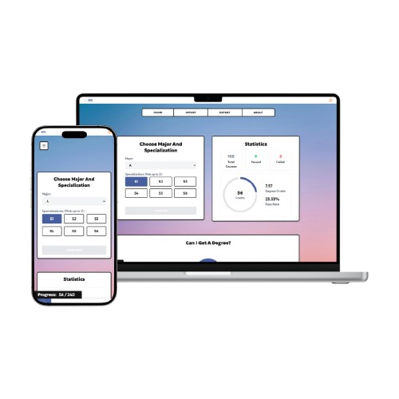

# 📚 Grade Calculator

A web app built with **React**, **Vite**, and **Tailwind CSS** to help students track their academic progress based on their grades and credits.

## Features

- **Degree Progress Tracking**: Calculate and visualize your academic journey.
- **Grade Calculation**: Calculate your degree grade based on entered courses and credits.
- **Edit Existing Courses**: Easily update or modify your courses and their details.
- **Import/Export JSON**: Import or export your course data in JSON format for easy management.
- **Course Requirement Tracking**: See the courses you need to take based on your major and academic specifications.
- **Toggle Language**: Switch between different languages for better accessibility.
- **Dark Mode**: Toggle between light and dark themes for a personalized user experience.

## Technologies Used

  
   &nbsp;
  
  
  &nbsp;

## Preview

## Links

- [Live Site](https://sophiabanou.github.io/grade-calculator/)
- [GitHub Repository](https://github.com/sophiabanou/grade-calculator)

## Credits

- Inspired by [ects.spyrosavl.com](https://ects.spyrosavl.com/)
